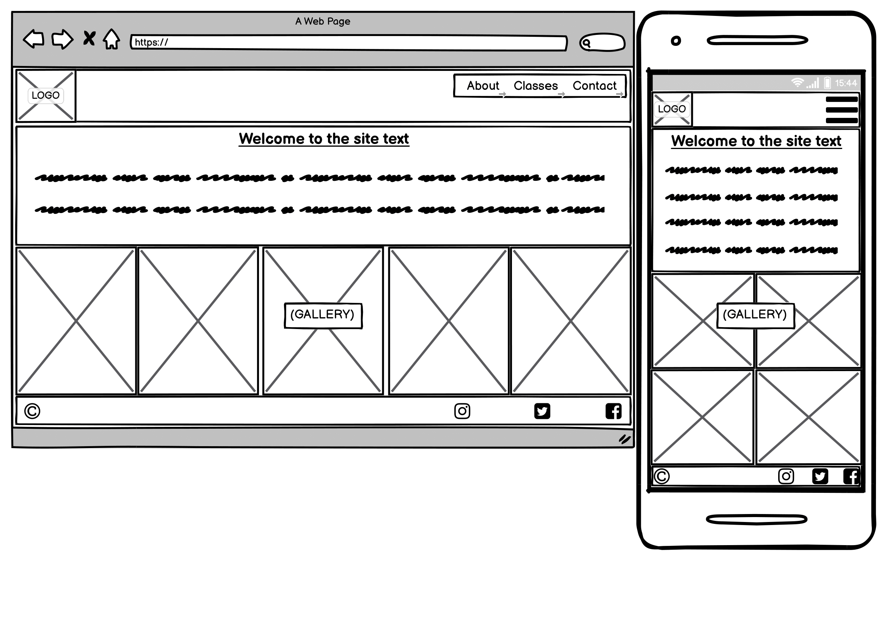
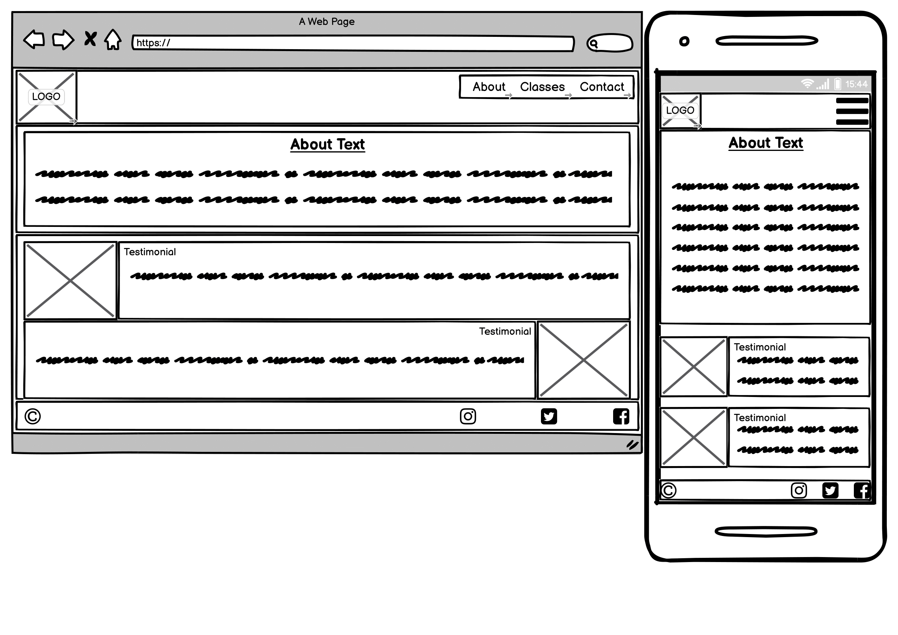
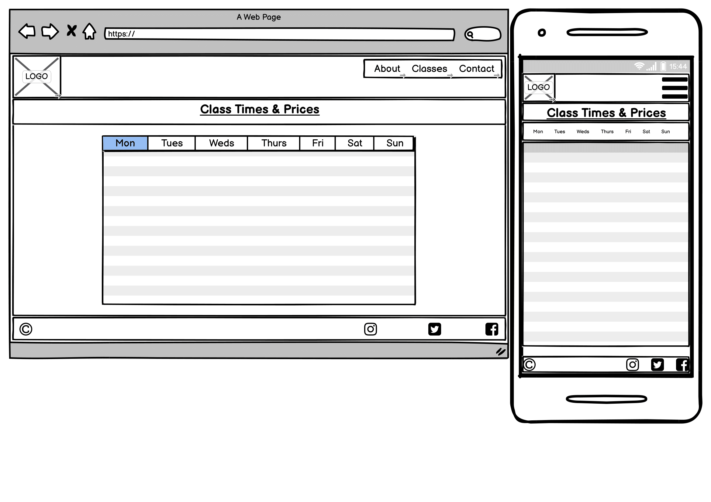
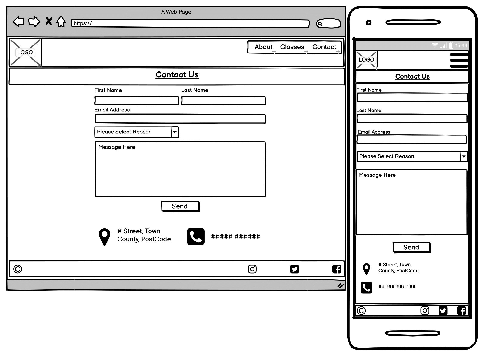

# Milestone Project 1

To present knowledge and understanding of modules learned by developing and implementing a static front-end web application using
languages HTML5 and CSS3. 

---

#  Central Wellness: The Wellbeing Hub.

## Table of contents.
 * Overview.
 * User Stories.
 * UX User Experience.
 * Features
 * Technologies Used.
 * Testing
 * Barriers & Solutions
 * Deployment
 * Resources
 * Credits
 * Acknowledgements

---

## Overview.
During these uncertain community hubs are needed more than ever with most still waiting to be reopened due to the COVID19 outbreak.  
With health services only able to see a select number of patients per day and social hubs remaining closed the populations physical 
and mental health is being put at risk.

A wellness centre aims to promote positive mental and physical wellbeing to the community by not only providing a gym with fitness 
classes but also by having experienced practitioners on site to help with other needs such as physiotherapy, acupuncture and
reflexology.

---

## User Stories
<strong><i>“As a loyal member of the centres website I....”</i></strong>

“need the contact information to be at hand for when I need to get in touch”\
“want to feel and be a part of the centres community via social media platforms”\
"want to visit the site and book classes using my mobile phone for when I'm on the go”\
"need Covid updates to keep me safe"

<strong><i>“As a new visitor to the centres website I....”</i></strong>

“need to see what the gym looks like and its facilities so I can make an informed decsion on whether to visit”\
“need to know opening times and class timetables so I can work it into my busy lifestyle”\
"want to visit the site and book a using my mobile phone for when I'm on the go”\
“need to know COVID restrictions and what’s being put in place to keep me safe”

---

## User Experience (UX)

---

## The Strategy Plane

### <ins><strong>Main goal of the site is to attract and retain a solid member base.</strong></ins>
#### <strong>How can this be achieved?</strong>
<strong><i>Target Audience</i></strong> - People who are isolated, people who are keen to get and keep fit / heal, 
lose weight, maintain overall wellbeing and generally look after oneself.
* Class timetable with prices.
* Available therapies.
* Contact page – contact form for any queries such as therapy booking and pricing and cancellations etc. 
The centres address will be provided on the contact page.
* What extra procedures are being put in place for COVID.

<strong><i>Creating an online community:</i></strong>
* Links to social media platforms
* Raising awareness of current health issues and how these can be overcome - selfcare and supportive environment.
* “What are you looking for?” Picture gallery – Reassuring Images: Smiling people at the gym and in classes, 
therapists at work, therapy rooms, social gathering following COVID restrictions. 
Mobile- first approach to site design.

<strong><i>Short, informative and concise text.</i></strong> – Introduction and Welcome Text, About Text including optional therapies and testimonials. 

<strong><i>Testimonials.</i></strong>

## The Scope Plane
<strong><i>Features and Functions:</i></strong>
* Fully responsive mobile first website – accessible from mobile devices, tablets and computers.
* Mobile device drop down nav bar.  Other devices nav bar text in the header section.
* Contact form – Drop down list on what the query is regarding, placeholder text, user query text box and submit button.
* “What are you looking for?” Picture gallery. Each picture will tie in with a reason for visiting the site.

Bootstrap is utilised to create the above and all features are kept within own abilities at this stage of the course.

## The Structure Plane
* Nav bar is located in the header section of each page.
* Social media links are located in the footer section of each page.
* All text will be short and concise and located next to images to keep an even visual balance to the user to maintain engagement with the site.
* The contact form will be presented on its own page as to not visually confuse the user.  It will have a drop box format for the user to choose what their reason is for contacting the centre with a message box for them to elaborate their reason in.
* The contact form will provide the centres address in the footer section along with the social media links.

## The Skeleton Plane:

Features – Existing and to be implemented

Technologies Used – html5, css3, bootstrap, font awesome, gitpod / hub etc.

Testing.

Barriers and how overcame.

Deployment – deployed version, deployment version.

Credits – sourced photos, CI template, code snippets.

Acknowledgements / reference links – Mentor, CUFD Lead, Slack Community etc.

